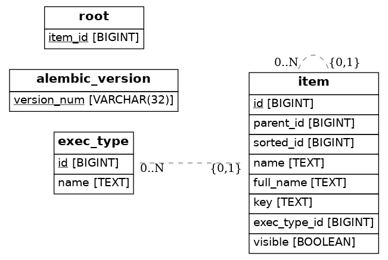

# GraphQL API item menu manager


## Оглавление
  * [API](#api)
    + [Запуск](#запуск)
    + [Тесты](#тесты)
    + [БД](#БД)


## API
* GraphQL UI: [`http://localhost:8000/graphiql?query={}`](http://localhost:8000/graphiql?query={})
* GraphQL Non-UI: [`http://localhost:8000/graphql`](http://localhost:8000/graphql)


### Запуск
* Инициализировать виртуальное окружение
* Убедиться что запущен PostgreSQL
* Поставить зависимости и создать базу данных
```shell script
make build
```
* Для локальной конфигурации необходимо в директории `config` создать на основе `settings.yml` файл `settings.local.yml`, 
иначе используются дефолтные настройки, которые подтягиваются в `config.py`
```shell script
cp settings.yml settings.local.yml
```
либо в рабочей директории создать на основе `dev.env` файл `.env`, где указать в переменной другие доступные настройки 
из `settings.yml` (можно также добавить свою конфигурацию в `settings.yml`, но тогда необходимо исключить загрузку файла 
в удаленный репозиторий),

либо создать в рабочей директории `.env` файл, где указать локальные настройки в утвержденном формате перечня 
переменных окружения
* Запуск производить из корневого каталога проекта
```shell script
make run
```


### Интеграция с сервисом авторизации
Для инициализации отображения пунктов в зависимости от прав пользователя в настройках в разделе `SERVICES.auth` указать:
* `active: true`
* Адрес сервиса в `host`


### Тесты
```shell script
make tests
```


### БД
* Схема



* Создание миграций
```shell script
make migrations
```
* Применение миграций
```shell script
make migrate
```
* Снятие дампа
```shell script
make dump
```